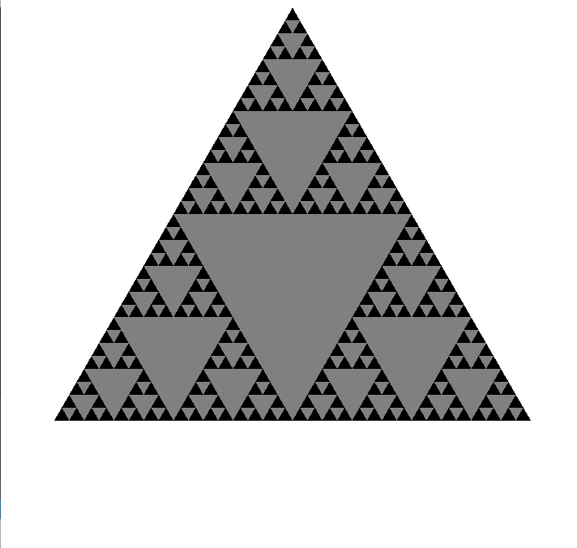
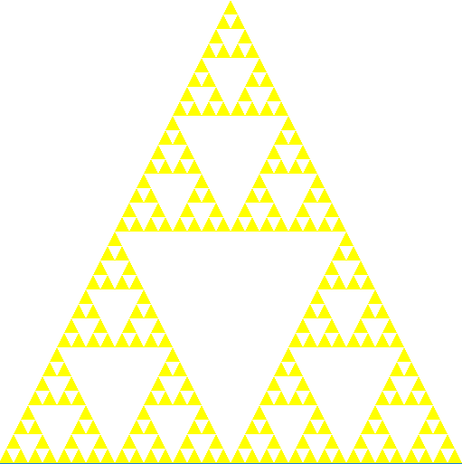
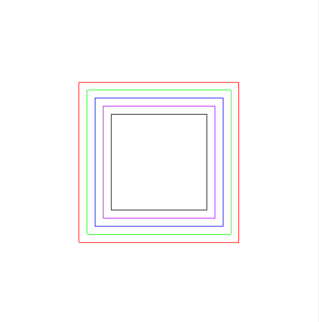
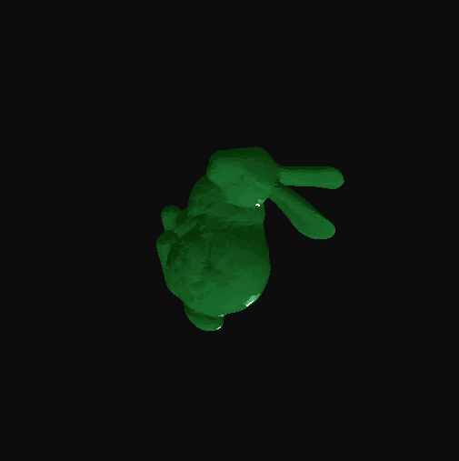

## Computer Graphics

This repository is for **Computer Graphics** lecture related materials and assignments   

---
### Assignments

</img>
</img>
</img>
</img>

---

## Library
C++ based on OpenGL  
For more information visit: 
* [OpenGL officials](https://www.opengl.org)
* [OpenGL tutorial](http://www.opengl-tutorial.org/kr/)
* [OpenGL installation guide](https://github.com/ameliacode/Computer_Graphics/blob/master/install_guide.md)
